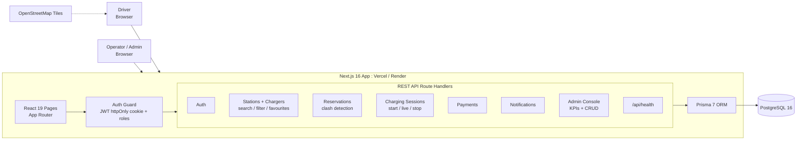
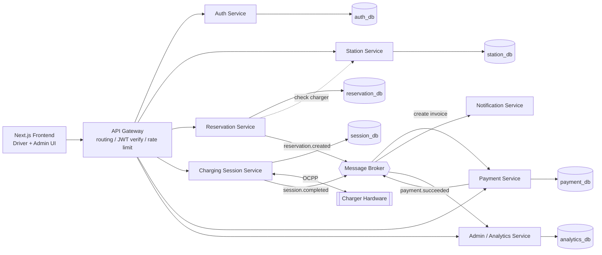
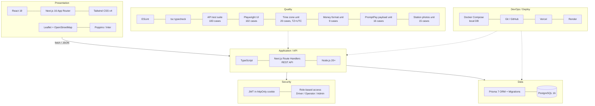
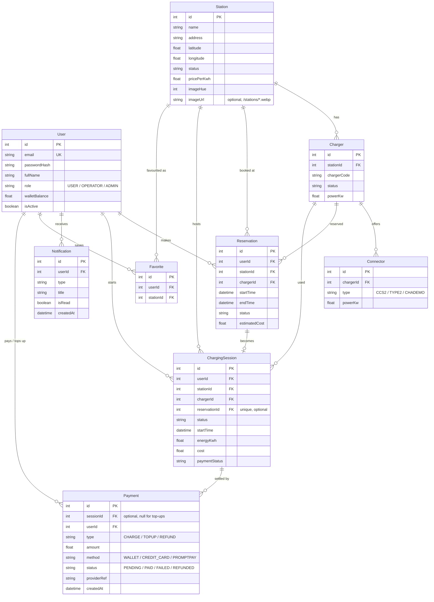
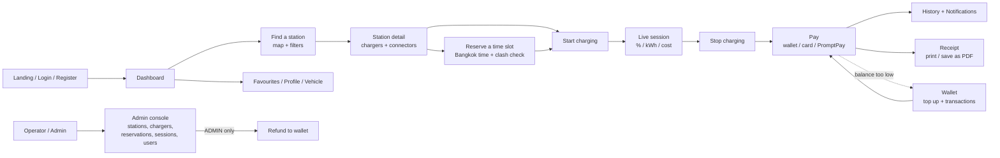
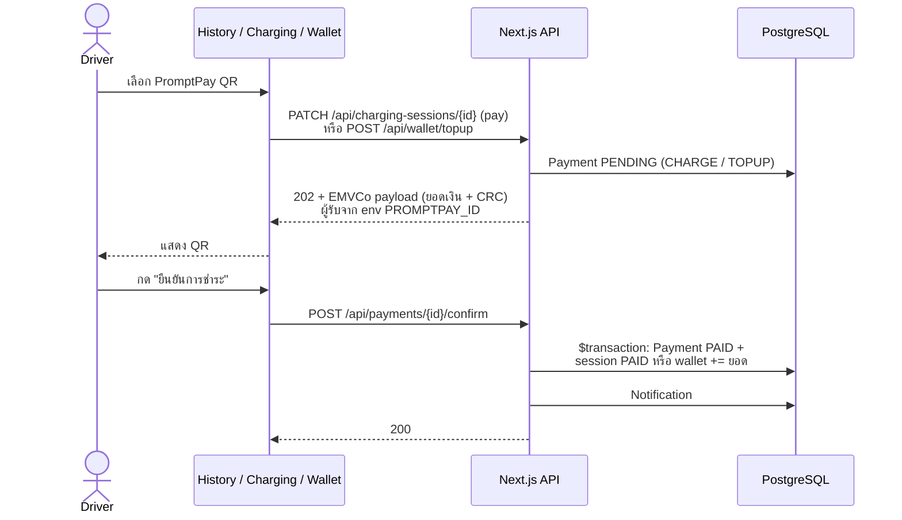
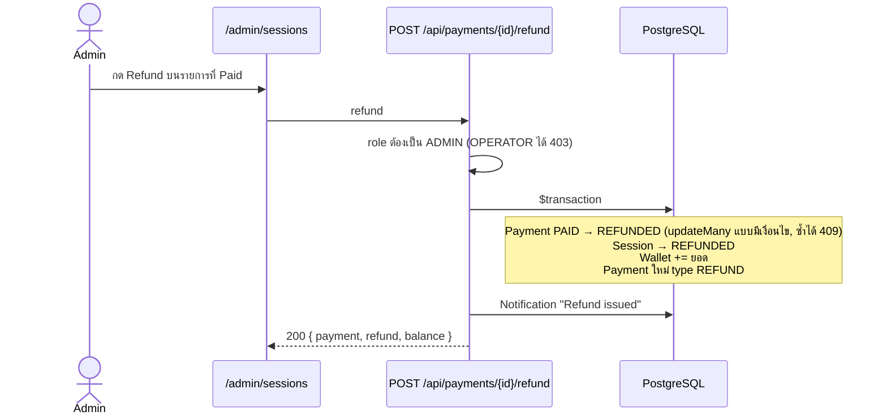

# Volt Grid — System Diagrams

## 1. Current Architecture (Next.js Full-stack Monolith)

ระบบปัจจุบันเป็น Next.js แอปเดียว ทั้งหน้าเว็บและ REST API (Route Handlers) อยู่ในโปรเจคเดียวกัน ใช้ Prisma ต่อ PostgreSQL ตัวเดียว

## 2. Target Microservices Architecture

แผนแยกแต่ละ domain ออกเป็น service อิสระ แต่ละตัวมี database ของตัวเอง สื่อสารผ่าน API Gateway และ event ผ่าน Message Broker (เป็นแผนในอนาคต ยังไม่ได้พัฒนา)

## 3. Technology Stack

## 4. ER Diagram (Database)

ความสัมพันธ์ของตารางทั้งหมดใน `prisma/schema.prisma` (PostgreSQL)

## 5. User Journey

## 6. PromptPay Payment Flow

ทั้งจ่ายค่าชาร์จและเติมเงิน ใช้ QR แบบ EMVCo ที่ใส่ยอดเงินจริง แล้วยืนยันการรับเงินแบบจำลอง (ยังไม่ได้ต่อธนาคาร)

## 7. Refund Flow (Admin)

